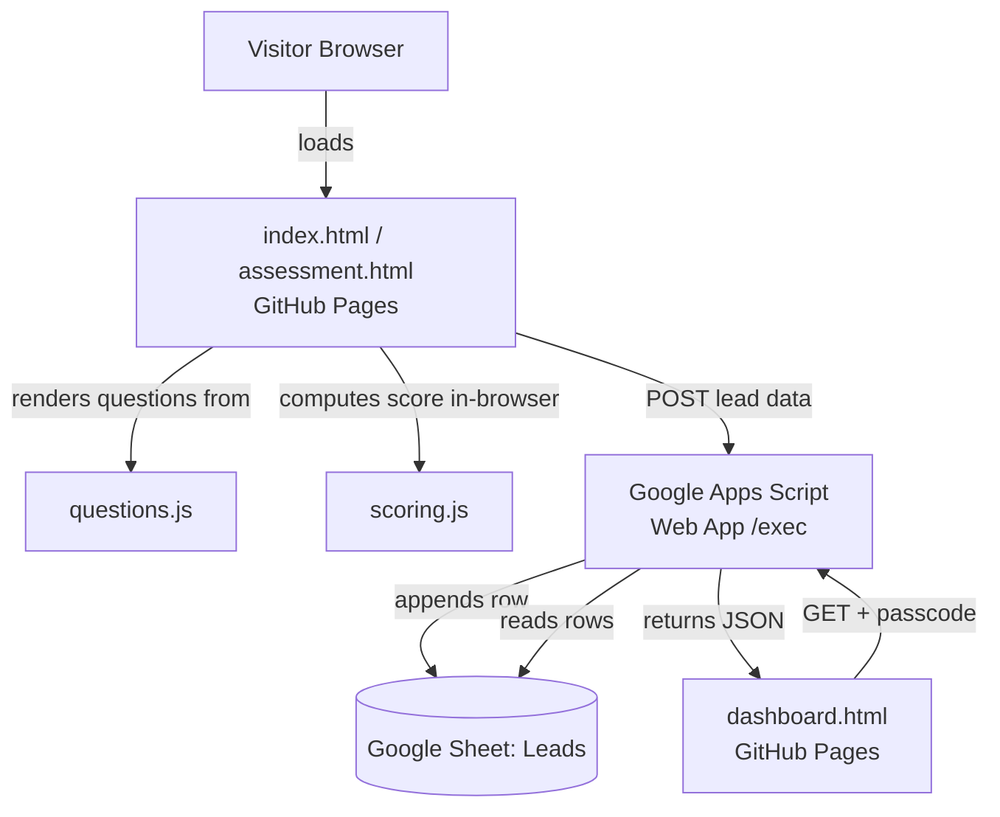
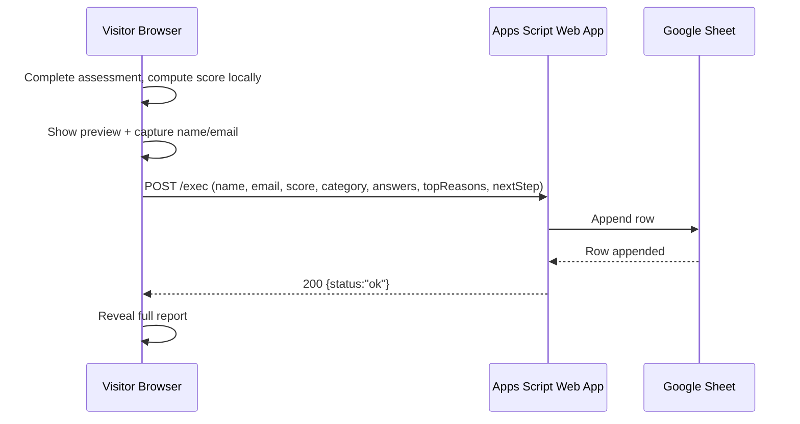

# ARCHITECTURE.md — GCC Fit Assessor v1.0

## 1. Tech Stack (Final)

| Layer | Choice | Why |
|---|---|---|
| Frontend | Static HTML/CSS/vanilla JS | Matches your 60-Day Challenge single-file build style, zero build tooling, deploys instantly on GitHub Pages. Already locked in Blueprint. |
| "Backend" / API | Google Apps Script Web App (bound to the Leads Google Sheet) | Free, no server to run/maintain, gives the static frontend a POST/GET HTTP endpoint. This is the standard pattern for turning a Sheet into a lightweight database. |
| Database | Google Sheet ("Leads" tab) | Chosen by you for zero signup friction. Good enough for capstone-scale lead volume; flagged fragility below. |
| Authentication | None for visitors. Dashboard: unlisted route + a simple passcode checked inside the Apps Script (not client-side only). | Matches FR-9 ("not real auth"), but a server-side passcode check is a small upgrade over pure obscurity — see Note below. |
| AI Model/API | None. Scoring is deterministic (ported existing rules), no LLM call needed. | PRD does not require generative AI in the v1.0 flow. |
| Hosting | GitHub Pages | Free, already connected, auto-deploys on push to `main`. |
| Other tools | Google Apps Script editor (script.google.com), Google Sheets | Both free, no separate accounts beyond your existing Google account. |

### Note on the dashboard passcode (flagging per your instructions)
The Blueprint/PRD only require an unlisted URL (FR-9, "simple obscurity, not real auth"). Because the Apps Script GET endpoint is technically callable by anyone who finds the URL (not just people who load `dashboard.html`), I'm adding one extra line of protection: the Apps Script checks a passcode parameter before returning lead data. This is still not visitor login (out of scope stays out of scope) — it just closes the gap between "unlisted page" and "unlisted API returning everyone's email addresses." No PRD requirement changes; flagging for your awareness, not asking to change scope.

## 2. Component Diagram

## 3. Data Flow

1. Visitor opens `assessment.html` (served statically from GitHub Pages).
2. `questions.js` renders the existing assessment questions client-side.
3. On submit, `scoring.js` computes score + category + top 3 reasons + next step **in the browser** (no server round-trip needed for this part).
4. Visitor sees the **preview** (score + top reasons) and is prompted for name + email.
5. On submitting name + email, the browser sends one `fetch()` POST to the Apps Script Web App URL with the full lead payload.
6. Apps Script appends a row to the "Leads" sheet and returns `{status: "ok"}`.
7. Full report (recommended next step) reveals client-side immediately — it does not wait for the save to display, but the app shows a small "saved ✓" / "retry" indicator so leads are never silently lost.
8. Founder opens `dashboard.html` (unlisted URL), enters the passcode once, and the page calls the same Apps Script Web App with a GET request; Apps Script validates the passcode, reads all rows, returns JSON, and the page renders a table.

## 4. Request Lifecycle (Lead Submission)

## 5. AI Interaction
Not applicable — v1.0 has no generative AI call. All scoring logic is deterministic, ported from the existing Fit Assessor.

## 6. External Services
- **GitHub Pages** — static hosting, auto-deploy on push to `main`.
- **Google Apps Script** — serverless request handler, deployed as a Web App tied to your Google account.
- **Google Sheets** — the lead database.

No other external services (no payment, booking, or CRM integrations — matches PRD out-of-scope list).
