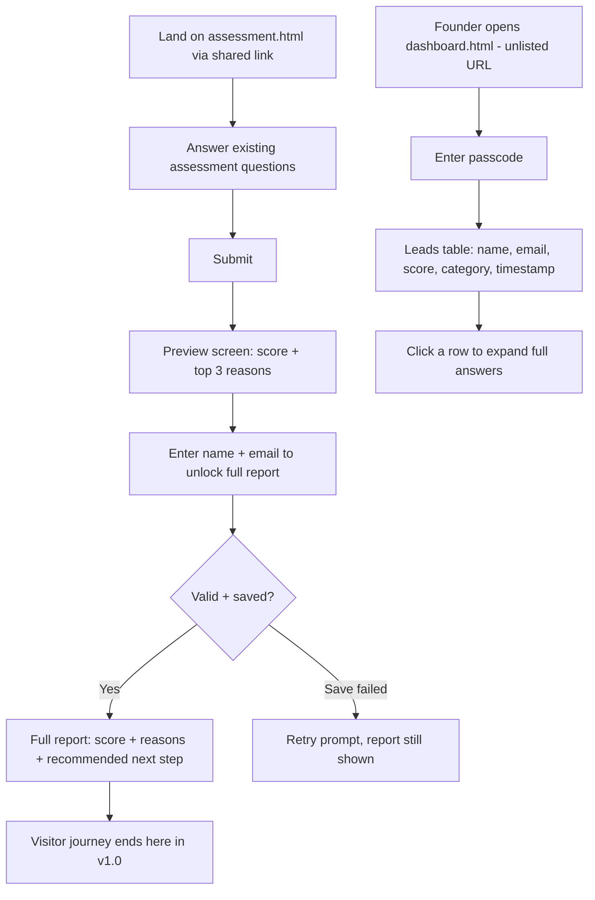

# UI-WIREFRAMES.md — GCC Fit Assessor v1.0

## 1. User Flow Diagram



## 2. Screen Inventory (every screen exists for a reason — PRD check)

| Screen | Purpose | PRD requirement |
|---|---|---|
| `assessment.html` — Question flow | Capture answers | FR-1 |
| `assessment.html` — Preview (score + reasons) | Motivate lead capture without giving everything away free | FR-3, FR-4 |
| `assessment.html` — Lead capture form | Get name + email | FR-4 |
| `assessment.html` — Full report | Deliver value, close the loop | FR-3 |
| `dashboard.html` — Passcode gate | Minimal protection per FR-9 + Note in ARCHITECTURE.md | FR-9 |
| `dashboard.html` — Leads list | Founder follow-up | FR-6 |

No extra screens (no login/signup for visitors, no settings page, no multi-page report — all correctly excluded per PRD 5.2).

## 3. Low-Fidelity Wireframes

### Screen 1 — Assessment (Question flow)
```
┌─────────────────────────────────────┐
│  GCC Fit Assessor                    │
│  ●●●○○○  (progress dots)             │
│                                       │
│  Q3. How many employees does your    │
│      company currently have?         │
│                                       │
│  ( ) 1-10                            │
│  ( ) 11-50                           │
│  ( ) 51-200                          │
│  ( ) 200+                            │
│                                       │
│           [ Back ]  [ Next → ]       │
└─────────────────────────────────────┘
```

### Screen 2 — Preview (score teaser)
```
┌─────────────────────────────────────┐
│         Your Fit Score               │
│                                       │
│            78 / 100                  │
│         "Strong Fit"                 │
│                                       │
│  Top reasons:                        │
│  1. [reason 1]                       │
│  2. [reason 2]                       │
│  3. [reason 3]                       │
│                                       │
│  Enter your details to see your      │
│  recommended next step →             │
│                                       │
│  [ Name             ]                │
│  [ Email             ]               │
│         [ Unlock Full Report ]       │
└─────────────────────────────────────┘
```

### Screen 3 — Full Report (post-capture)
```
┌─────────────────────────────────────┐
│  ✓ Saved                             │
│                                       │
│         78 / 100 — Strong Fit        │
│                                       │
│  1. [reason 1]                       │
│  2. [reason 2]                       │
│  3. [reason 3]                       │
│                                       │
│  Recommended next step:              │
│  "[next step text]"                  │
└─────────────────────────────────────┘
```

### Screen 4 — Dashboard (passcode gate)
```
┌─────────────────────────────────────┐
│  Dashboard access                    │
│  [ Passcode          ]  [ Enter ]    │
└─────────────────────────────────────┘
```

### Screen 5 — Dashboard (leads list)
```
┌───────────────────────────────────────────────────┐
│  Leads (12)                                        │
├───────────┬────────────────┬───────┬──────┬────────┤
│ Name      │ Email          │ Score │ Cat. │ When   │
├───────────┼────────────────┼───────┼──────┼────────┤
│ Jane Doe  │ jane@co.com    │  78   │Strong│ Jul 22 │
│ Sam Lee   │ sam@firm.com   │  45   │Mod.  │ Jul 21 │
└───────────┴────────────────┴───────┴──────┴────────┘
  (click row → expands to show full answers JSON)
```

## 4. Navigation
- No global nav bar — this is a linear funnel, not a multi-section site.
- `assessment.html` has zero links to `dashboard.html` (FR-9 — kept unlinked).
- `dashboard.html` is reached only by typing/bookmarking its direct URL.
